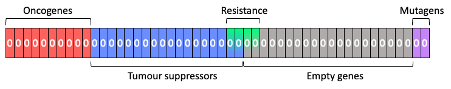

# Simulating Tumour Progression Using a Genetic Algorithm and Rule-Based Principles of Cellular Automata

## Table of Contents
1. [Introduction](#intro)
2. [Algorithm description](#descr)
3. [Folder contents](#conts)
4. [Running instructions](#instr)
5. [References](#refs)

***


<a name="intro"></a>
## Introduction

Tumour growth draws many parallels with Darwinian evolution (Pepper _et al._, 2009). Cancer cells arise, and tumours develop through natural selection of small inherited variations that increase an individual cell’s ability to survive and proliferate. Tumours grow because the fitness of a cell (i.e. their ability to replicate) increases, making them more likely to develop mutations that further stimulate replication. This parallel is further exemplified with the addition of therapies adding a selection pressure to the tumour population, which then selects for therapy-resistant cell clones.

A genetic algorithm is a computational method for solving optimisation problems. The algorithm is heavily inspired by the principles of natural selection (Kumar _et al._, 2010). A fitness function is defined, and a population of individual solutions is continually modified until an optimal solution of the fitness function converges in the population. The solutions are modified by mutation, which, analogous to single point mutations of DNA that occur in cancer, is a random probability that a random ‘bit’ in the solution’s parameters will be flipped/changed in the next generation. The second method of introducing variation in the solutions is the crossover, inspired by sexual reproduction. Two ‘parent’ solutions are randomly split at the same location, and the splits are switched to generate two modified ‘offspring’. Of course, cancer cells do not sexually reproduce. However, there is evidence in the literature that DNA is shared between cancer cells. Miroshnychenko _et al._ (2021) recently demonstrated that tumour cells can undergo spontaneous cell fusions to generate diverse progeny with the inheritance of parent alleles, indicating parasexual recombination. Thus, the genetic algorithm seems fitting to simulate tumour growth and therapy resistance. 

Lastly, the genetic algorithm must select solutions to pass into the next generation, whereby fitter solutions are more likely to be selected. Numerous selection methods exist, but here we build our selection method by integrating rule-based methods of cellular automata with our fitness function.

***
<a name="descr"></a>
## Algorithm description

First, we create a Cell object within which we create a NumPy array of 50 zeroes (Figure 1). Each bit in this array represents one gene in our cancer cell genome, and a switch from a zero to a one is indicative of a mutated gene. As with biology, genes within this array contain different functions relevant to cancer growth; tumour suppressors, oncogenes, therapy resistance, and mutagenic.



Our fitness function is relatively simple. The sum of mutated oncogenes minus the sum of mutated tumour suppressors, and we define a cancer cell as having a fitness above 0. This is because loss of function mutations must occur in tumour suppressor genes, and gain of function mutations must occur in oncogenes. We also start with twice as many tumour suppressors as oncogenes for two reasons. Firstly, this mimics Knudson’s two-hit hypothesis (1971) where inactivation of both alleles of tumour suppressors leads to loss of function. Secondly, this means the steady-state of random mutations does not converge to a fitness of zero, and the algorithm must optimise the function to produce cancer cells.

The chemo-resistance genes must all be zeroes to confer therapy resistance. These genes intentionally overlap with the tumour suppressor genes such that the algorithm must reduce the fitness to adapt to therapy. In conditions where therapy is present, this theoretically changes the fitness function to optimise the oncogenes minus tumour suppressors conditional on all resistance genes being zeroes. Mutagenic genes were added to simulate the actual biology of cancer in that the mutation rate of a tumour cell is often increased.

Our mutation function of the genetic algorithm works by iterating through the gene set and, with a defined probability (default of 0.1% multiplied by the number of mutagen mutations squared), flips the zero to a one or vice versa. Our crossover function takes two cells as arguments, randomly split their genomes, swaps, and re-appends the splits to produce two distinct offspring cells. The brightness of each cell is indicative of the mutational burden.

Lastly, a cellular automaton with a rule-based selection method was used to simulate tumour growth (Figure 2). Firstly, a grid of new cells is defined, and each generation is indicative of cellular replication. After each generation, the mutation function is called on each cell. Mutational noise increases over time within the cell population, as with ageing. Eventually, the fitness function of a cell evaluates to above 0, and the cell is defined as cancerous and turns red. A cell in this cancerous state replicates at twice the rate as a healthy cell, and so it searches its surrounding eight neighbouring cells in the grid. This cancerous cell replaces the least fit neighbour in the population, again undergoing mutation before the next generation. When adjacent to one or more cancer cells, a random cancer cell is selected to perform the crossover function.


When therapy is added, cancer cells stop dividing and cells on the periphery of the tumour start to die and be replaced by new, healthy cells. However, if a cancer cell is therapy-resistant, it turns green and continues to be able to replace its weakest neighbour in the next generation.

The visualisation was adapted from a cellular automaton script developed by Fraser Love in 2021.

***
<a name="conts"></a>
## Folder contents

+ **\_\_init\_\_.py** - file to mark the directory as a python package directory.
+ **cansim.py** - main python script to be run.
+ **cancer\_cell.py** - module that contains functions and attributes of a cell.
+ **genetic\_algorithm.py** - module that contains functions of the genetic algorithm.
+ **README.pdf** -pdf version of this file.
+ **README.md** - markdown version of this file.
+ **LICENSE** - license information generated through GitHub.
+ **cell\_counts.png** - auto-generated graph of cell counts per generation.
+ **cell\_fitness.png** - auto-generated graph of cell fitness per generation.
+ **sim\_example.mov** - example video of a simulation.
+ **requirements.txt** - auto-generated graph of cell counts per generation.
+ **.gitignore** - files to ignore when committing using git.
+ **images** - images for markdown.


***
<a name="instr"></a>
## Running instructions

This package was built using python version 3.8.12. The package requirements can be found in the requirements.txt file. These packages can be installed simultaneously with the command:

```pip install -r requirements.txt”```

In the terminal, navigate to the tumour_simulation directory. Once there, type the following command to begin the simulation:

```python cansim.py```

To customise the dimensions of the simulation at the flag ```--dimensions x```, where x represents the number of pixels. It is recommended to keep this value below 1000, as the simulation becomes very computationally expensive, especially when most cells are cancerous.

To customise the mutation rate from the default of 0.001, add the flag ```--mutation x```, where x is a float less than 1.

```python cansim.py –dimensions 300 –mutation 0.01```

Pressing ```SPACE``` will toggle on and off the presence of therapy in the simulation.

Pressing ```RETURN``` will pause/unpause the simulation.

Terminate the simulation by exiting the pygame window. This will then overwrite the .png files in the directory with plots from that simulation (black dashed lines indicate therapy turning on, grey dashed lines indicate therapy turning off. With the default parameters, cancer cells appear at ~150 generations.

***
<a name="refs"></a>
## References

Kumar, M., Husain, M., Upreti, N., Gupta, D. 2010. Genetic algorithms: review and application. _International Journal of Information Technology and Knowledge Management_. **2**(2), pp.451–454.

Knudson, A.G. 1971. Mutation and cancer: Statistical study of retinoblastoma. _Proceedings of the National Academy of Sciences_. **68**, 820–823.

Miroshnychenko, D., Baratchart, E., Ferrall-Fairbanks, M.C., Vander Velde, R., Laurie., A, Bui, M.M., Tan, A.C, Altrock, P.M., Basanta, D. and Marusyk, A. 2021. Spontaneous cell fusions as a mechanism of parasexual recombination in tumour cell populations. _Nature Ecology and Evolution_. **5**, pp.379–391. 

Love, F. 2021. _Python-algorithms-and-simultations (Github)_. [Online]. Available from: https://github.com/fraserlove/python-algorithms-and-simulations

Pepper, J., Findlay, C.S., Kassen, R., Spencer, S.L. and Maley, C.C. 2009. Cancer research meets evolutionary biology. _Evolutionary Applications_. **2**(1), pp.62–70.

